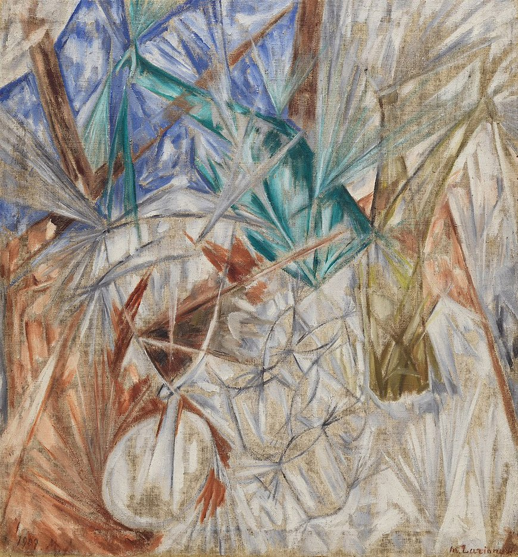

"Steklo". Photo credit: © 2018 Artists Rights Society (ARS), New York / ADAGP, Paris

# Steklo

Steklo, named after the [rayonist painting "Glass"](https://www.guggenheim.org/artwork/2408),
is the first merge devnet of the [Rayonism](https://rayonism.io) project. It's a fragile but useful material.

It generally follows the Rayonism spec, which is Eth1 up to and incl. Berlin, Eth2 phase0 with Merge extension (i.e. no Altair fork yet), and is configured with mainnet-like settings.

Config files:
- [eth1 config (geth format)](https://github.com/protolambda/steklo/blob/master/eth1_config.json)
- [eth1 config (nethermind/open-ethereum format)](https://github.com/protolambda/steklo/blob/master/eth1_nethermind_config.json)
- [eth2 config](https://github.com/protolambda/steklo/blob/master/eth2_config.yaml)

Assets:
- [`genesis.ssz`](./genesis.ssz)

Data:

```yaml
genesis_time: 1619784000   # 2021-04-30 12:00:00 UTC
genesis_state_root: 0x7ddc09fece5a320cd0d09a6bd20a1140c4c2afd7298421ddeecf91f383db003b
genesis_block_root: 0xb8db6776f4a1a27f92688298fbdd98161999e9d726324affae423b7a21e6dca4
genesis_validators_root: 0xcca74cd576b4f7e395f0cb6c61a3bb57c1d0c1a1f08e7ce2652966736b14535c
genesis_validators_count: 18432
genesis_active_validators_count: 18432
genesis_total_active_stake_gwei: 589824000000000
genesis_total_balance_gwei: 589824000000000
eth1_data:
  deposit_root: 0xd70a234731285c6804c2a4f56711ddb8c82c99740f207854891028af34e27e5e
  deposit_count: 0
  block_hash: 0xa0aaf8d2c42e1c5f377a65f4859e8bca7198688b029b4c3d3243f8b62492657b
eth1_chain_id: 701
deposit_contract_address: 0x4242424242424242424242424242424242424242
genesis_fork_version: 0x00000701
genesis_fork_digest: 0x79f80e5d
pre_genesis_fork_digest: 0xbe18b010
execution_payload:
  block_hash: 0xa0aaf8d2c42e1c5f377a65f4859e8bca7198688b029b4c3d3243f8b62492657b
  parent_hash: 0x0000000000000000000000000000000000000000000000000000000000000000
  coinbase: 0x0000000000000000000000000000000000000000
  state_root: 0xa486cb9244d30e15b792e20c24da6baac5abb67330168df18135d2ce6d2497f3
  number: 0
  gas_limit: 4194304
  gas_used: 0
  timestamp: 1619784000   # 2021-04-30 12:00:00 UTC
  receipt_root: 0x56e81f171bcc55a6ff8345e692c0f86e5b48e01b996cadc001622fb5e363b421
  logs_bloom: 0x00000000000000000000000000000000000000000000000000000000000000000000000000000000000000000000000000000000000000000000000000000000000000000000000000000000000000000000000000000000000000000000000000000000000000000000000000000000000000000000000000000000000000000000000000000000000000000000000000000000000000000000000000000000000000000000000000000000000000000000000000000000000000000000000000000000000000000000000000000000000000000000000000000000000000000000000000000000000000000000000000000000000000000000000000000000
  transactions_root: 0xe05ac02c0a8f889909fdb5ff44a8267e088b0e7eb6c11bbea096023884da27b8
```
